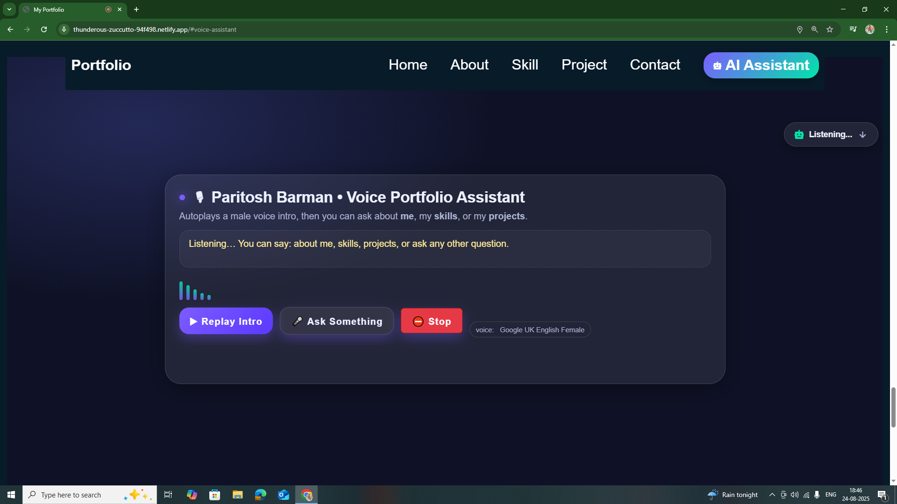
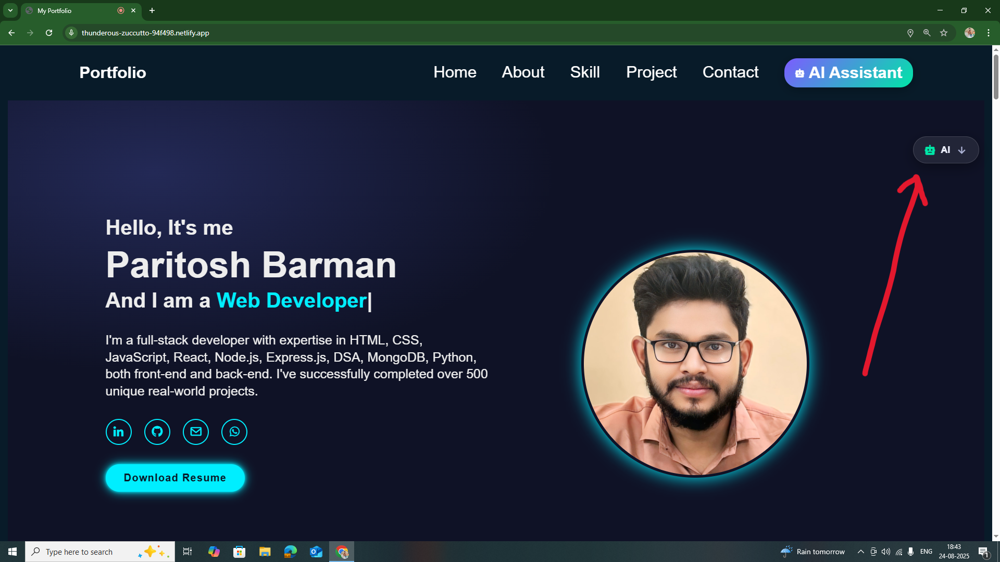
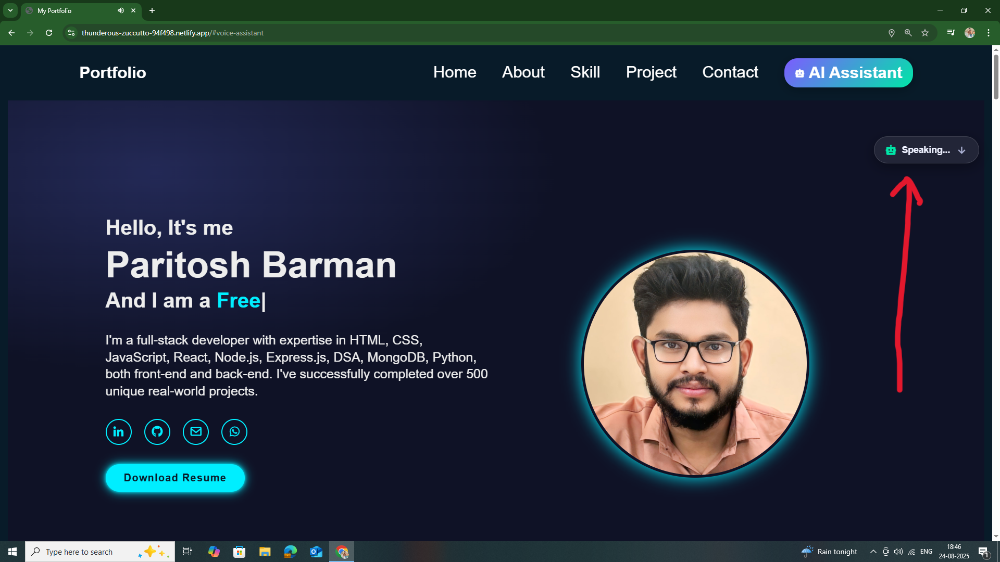
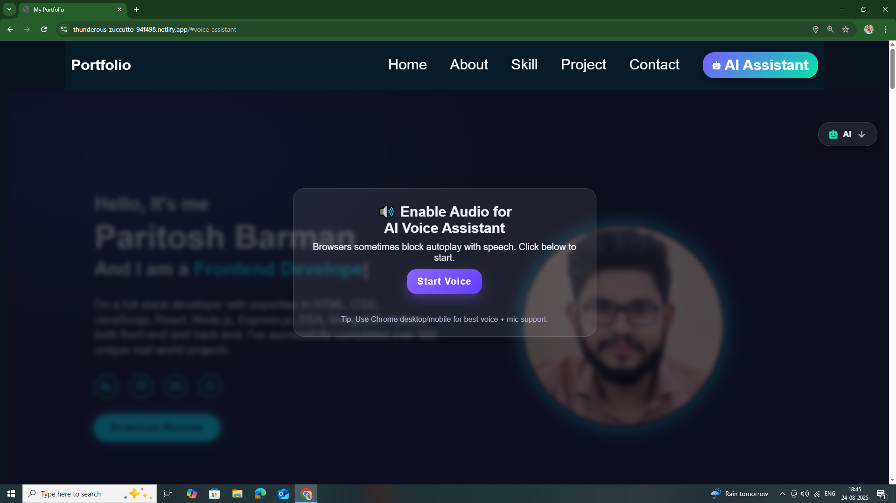
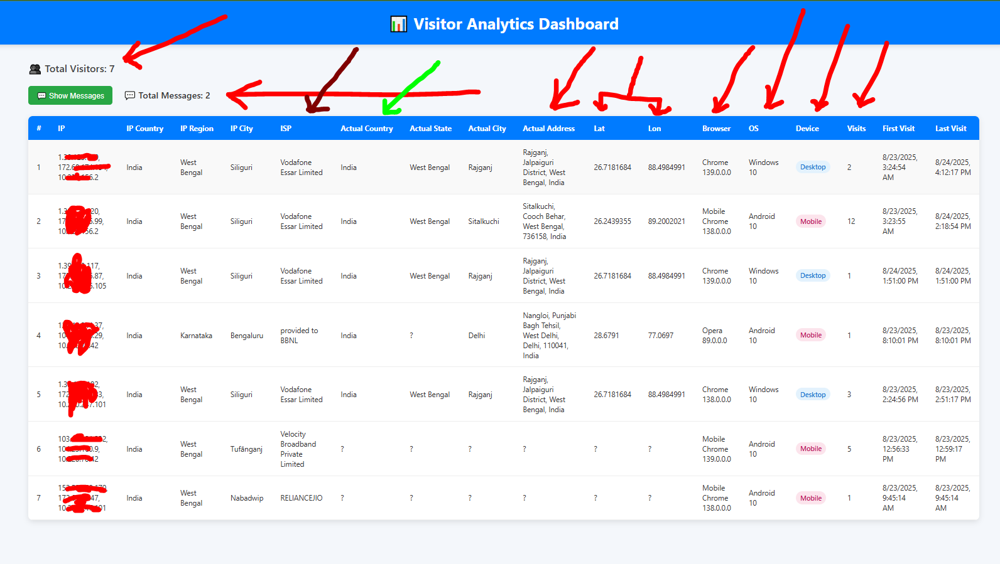

# Paritosh Barman -- Full Stack Developer Portfolio

[Visit Live Portfolio](https://thunderous-zuccutto-94f498.netlify.app/)

------------------------------------------------------------------------

## 📖 About This Repository

This repository contains the source code for my personal portfolio ---
an interactive, voice-enabled experience powered by a **custom AI Voice
Assistant** that I created using **Node.js + Express** for the backend
and **vanilla HTML, CSS, and JavaScript** for the frontend.

Rather than being just another portfolio website, this project reflects
**my journey, skills, projects, and story in a conversational way**. The
assistant speaks as me (Paritosh Barman), answers questions naturally,
and guides users to explore my background, projects, and career vision.

------------------------------------------------------------------------

## 🎙️ AI Voice Assistant Features

-   **Identity Simulation**\
    Speaks in first-person as *me*, always staying in character,
    confident, and human-like.

-   **Interactive Conversation**\
    Understands queries and provides meaningful answers about my skills,
    projects, freelancing, career, hobbies, and goals.

-   **Dynamic Flow**\
    Closes every response with a natural follow-up question, making the
    interaction smooth and engaging.

-   **Messaging Option**\
    Users can **send a message** directly via the AI assistant.
    Just say "send a message" or "drop a message", and it will be
    delivered to me via the backend system.
    And All messages are collected in a backend database system and can be viewed in the
    **Visitor Analytics Dashboard**.

-   **Interview Mode**\
    Switches to professional, concise, and structured answers (STAR
    method) when asked interview-style questions.

-   **Personal Guidance**\
    Shares how to connect with me (GitHub, LinkedIn, Email, Phone) and
    encourages recruiters/collaborators to reach out.

------------------------------------------------------------------------

## 📊 Visitor Analytics Dashboard

-   Tracks **all visitors** to the portfolio website in real time.
-   Collects details like:
    - IP address & ISP
    - Country, State, City
    - Browser, Operating System, Device
    - Visit count, first visit, last visit
-   **View Messages:** Shows messages left by visitors through the AI messaging system.
-   Helps improve the AI assistant experience and understand audience engagement.

------------------------------------------------------------------------

## 🚀 About Me

I'm **Paritosh Barman**, a **Full Stack Developer (MERN)** and
**Automation Enthusiast**.\
- From Coochbehar, West Bengal --- currently in Delhi.
- Self-taught coder who started with **C programming during Diploma in
Electrical Engineering**.
- Couldn't complete the diploma due to Covid-19 & financial struggles,
but I never stopped learning.
- Learned **Python, Django, Selenium, OpenCV, Tkinter, server configs**,
and freelanced for local businesses.
- Later, joined **Prepleaf by Masai (IIT Kanpur instructors)** where I
mastered **JavaScript, Advanced React, MERN stack, and DSA**.
- Built **500+ projects** across web, automation, IoT, and robotics.
- Currently looking for **MERN stack internships or full-time roles**
and aiming to grow into a **technical project leader**.

------------------------------------------------------------------------

## 🛠️ Tech & Projects

### Freelance Web Projects

-   **Smart Field Manager** -- B2B real-time executive tracking with
    maps, JWT, and WhatsApp integration.
-   **ChemiBoost ERP** -- ERP for pharmacies & chemical manufacturers.
-   **Asso Pharma Website** -- Django site with doctor directory,
    WhatsApp automation, and blogging.
-   **Skill Book Institute** -- Institute site showcasing Data Entry,
    AutoCAD, Graphic Design, and vocational training courses.

### Automation & Hardware Projects

-   **Tatkal Ticket Automation** -- Selenium + VPS/RDP + OTP handling
    (near 100% success rate).
-   **OCR Tools** -- Extract text from Aadhaar, Voter ID, QR codes into
    Excel.
-   **Auto Form Fill & Data Entry Software** -- Automated large-scale
    tasks for cyber cafes.
-   **Robotics & Drone Systems** -- Using ESP32, Arduino, OpenCV for
    automation.

------------------------------------------------------------------------

## 🎯 Vision & Goals

My portfolio is more than a resume --- it's **a story told through
interaction**.
I want recruiters, collaborators, and fellow developers to experience my
journey naturally.

In the next 5 years, I see myself as a **project leader/engineering
manager**, delivering impactful solutions, leading teams, and mentoring
developers.

------------------------------------------------------------------------

## 📸 Screenshots

| Screenshot Name                   | Description | Screenshot |
|-----------------------------------|-------------|------------|
| AI voice assistent section        | Dedicated AI Voice Assistant section where users can interact with the voice-enabled portfolio assistant. |  |
| Hero section with AI default status | Hero section of the portfolio showing AI assistant in default (idle) status. |  |
| Hero section with AI speeking status | Hero section when the AI assistant is actively speaking and responding to user queries. |  |
| Start voice permition enable option | Popup prompting the user to grant microphone access to start voice interaction with the AI assistant. |  |
| Visitor Analytics Dashboard       | Real-time Visitor Analytics Dashboard tracking IP, location, device, browser, OS, visits, and messages. |  |

------------------------------------------------------------------------

## 🔗 Quick Links

-   **Live Portfolio**:
    <https://thunderous-zuccutto-94f498.netlify.app/>
-   **LinkedIn**: [Paritosh
    Barman](https://www.linkedin.com/in/paritosh-barman-003257229)
-   **GitHub**: [ParitoshBarman](https://github.com/ParitoshBarman)
-   **Email**: <barmanpari163@gmail.com>
-   **Phone**: [+91 9091467852](tel:+919091467852)

------------------------------------------------------------------------

### 💬 Final Note

This portfolio merges **technology + personality**.\
It's not just about showing my work --- it's about letting you talk to
me, ask me questions, and discover my journey.

👉 Explore it, interact with it, and feel free to reach out.
